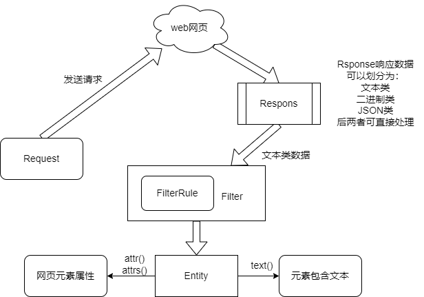

## 轻量级通用爬虫框架spider2local
### 1、框架设计

### 2、安装
```commandline
pip install spider2local
```
### 3、使用示例
```python
from spider2local import send_request, resp_filter, Request, Filter, FilterRule

if __name__ == '__main__':
    req = Request('https://gitee.com/')
    resp = send_request(req)
    rules = [FilterRule('title', {})]
    entity = resp_filter(Filter(resp, rules))
    print(entity.text())
```